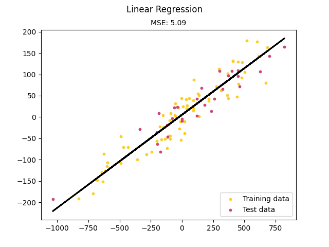
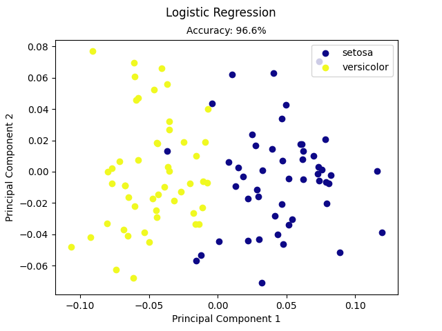
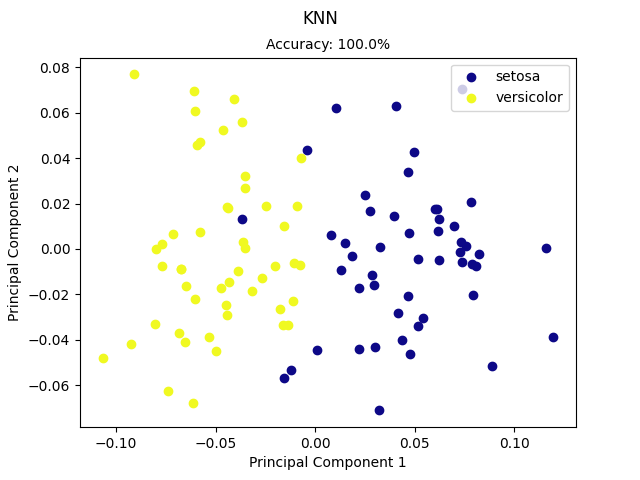

# TinyML
A tiny librarie with tweet-sized implementations of machine learning models in NumPy.


## Installation
```
$ git clone https://github.com/siAyush/TinyML.git
$ cd TinyML
$ sudo python setup.py install
```
## Run Examples
```
$ python tiny_ml/demo/knn.py
```

## Implementations

### Linear Regression


### Logistic Regression


### KNN

